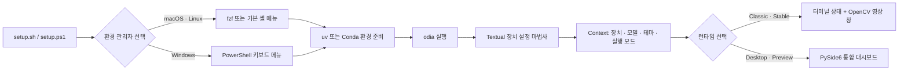

# ODIA 프로젝트 구성 — 인터페이스

> 이 문서는 프로젝트 소개 자료의 첫 번째 초안이다.  
> 나중에 슬라이드로 옮길 수 있도록 각 `##` 절을 한 장의 이야기 단위로 구성했다.

## 1. 인터페이스를 여러 층으로 나눈 이유

ODIA는 카메라, 마이크, AI 모델을 함께 준비해야 하므로 하나의 화면만으로 모든
과정을 처리하지 않는다. 대신 사용 목적에 따라 인터페이스를 세 층으로 나눈다.

1. **설치 인터페이스** — 실행 환경과 패키지 관리자를 선택한다.
2. **설정 인터페이스** — 사용할 장치와 AI 모델을 선택하고 실제 동작을 확인한다.
3. **런타임 인터페이스** — 음성 명령과 객체 탐지 결과를 실시간으로 보여준다.

핵심 원칙은 각 도구가 잘하는 일만 맡는 것이다. 셸은 설치와 프로세스 연결을,
Textual은 순차적인 설정을, OpenCV와 PySide6는 실시간 영상을 담당한다.

## 2. 전체 사용자 흐름



사용자는 설치 도구를 직접 조합할 필요가 없다. 부트스트랩이 환경을 준비한 뒤
`odia`를 실행하고, Textual이 수집한 설정값을 선택한 런타임에 전달한다.

## 3. fzf — 환경 관리자 선택 인터페이스

`fzf`는 ODIA의 패키지를 직접 설치하는 도구가 아니다. macOS와 Linux에서
**uv 또는 Conda를 고르는 첫 메뉴**로만 사용한다.

- 설치된 `fzf`가 있으면 우선 사용한다.
- 이전 실행에서 `.odia/tools/fzf/bin/fzf`에 설치한 로컬 복사본도 재사용한다.
- `fzf`가 없으면 사용자에게 프로젝트 내부 설치 여부를 묻는다.
- 설치를 거절하거나 설치에 실패하면 기본 셸 메뉴로 자동 전환한다.
- 메뉴를 건너뛰려면 `./bootstrap/setup.sh uv`처럼 인자를 직접 전달할 수 있다.

이 구조에서 `fzf`는 선택 경험을 개선하는 **선택적 의존성**이다. 없어도 설치
흐름 자체는 유지된다.

관련 코드: [`bootstrap/menus/fzf.sh`](../bootstrap/menus/fzf.sh),
[`bootstrap/tools/install_fzf.sh`](../bootstrap/tools/install_fzf.sh)

## 4. Shell과 PowerShell — 설치 오케스트레이터

macOS·Linux의 `setup.sh`와 Windows의 `setup.ps1`은 사용자가 처음 만나는
진입점이다. 두 스크립트는 운영체제에 맞는 메뉴를 제공하고, 선택한 환경 관리
스크립트에 제어권을 넘긴다.

### macOS와 Linux

- `setup.sh`가 운영체제와 입력 인자를 검사한다.
- `fzf` 메뉴 또는 `tput` 기반 기본 메뉴를 불러온다.
- 선택 결과에 따라 `bootstrap/managers/uv.sh` 또는 `conda.sh`를 `exec`한다.
- 환경 준비가 끝나면 해당 환경 안에서 `odia`를 시작한다.

### Windows

- `setup.ps1`이 방향키·숫자키 기반의 자체 메뉴를 제공한다.
- uv 또는 Conda를 프로젝트 내부 경로에 준비한다.
- 환경을 검증한 뒤 같은 `odia` 진입점을 실행한다.

셸 계층의 책임은 **선택 → 설치 → 검증 → 실행**까지다. 카메라나 모델 선택처럼
애플리케이션의 설정은 다음 Textual 계층에 맡긴다.

관련 코드: [`bootstrap/setup.sh`](../bootstrap/setup.sh),
[`bootstrap/setup.ps1`](../bootstrap/setup.ps1)

## 5. Textual — 장치 설정 마법사

`odia`가 시작되면 Textual 기반 TUI가 장치와 모델을 순서대로 설정한다. 단순히
목록에서 장치를 고르는 데서 끝나지 않고, 실제 테스트를 통과한 선택만 다음
단계로 넘기는 **검증형 마법사**다.

```text
Welcome / 테마 선택
        ↓
오디오 출력 선택 → 샘플 재생 → 사용자 확인
        ↓
마이크 선택 → 입력 레벨·녹음 → 재생 → 사용자 확인
        ↓
카메라 선택 → 열기 테스트 → 스트리밍 테스트 → 사용자 확인
        ↓
YOLO·Whisper 모델 선택
        ↓
설정 요약
        ↓
Classic 또는 Desktop 런타임 선택
```

완료 결과는 `Context` 객체 하나로 묶인다. 여기에는 카메라, 오디오 입력·출력,
비전·음성 모델, UI 테마, 런타임 모드가 들어간다. 이후 런타임은 Textual 화면에
직접 의존하지 않고 이 객체만 전달받는다.

관련 코드: [`src/detect_objects/tui/app.py`](../src/detect_objects/tui/app.py),
[`src/detect_objects/device_setup/context.py`](../src/detect_objects/device_setup/context.py)

## 6. Classic Runtime — 터미널과 OpenCV

Classic은 현재 **안정 버전**으로 표시되는 실행 방식이다.

- Textual 시작 화면이 모델과 장치 준비 상태를 보여준다.
- 실행 중 상태와 음성 인식 결과는 터미널에 출력된다.
- 실시간 카메라 영상과 YOLO 탐지 결과는 네이티브 OpenCV 창에 표시된다.
- Whisper는 별도 스레드에서 음성을 텍스트로 바꾸고, 탐지할 클래스 목록을
  큐를 통해 카메라·YOLO 실행부에 전달한다.
- 종료 시 런타임 관리자가 스레드, 카메라, 마이크, 모델 자원을 정리한다.

장점은 구현이 단순하고 OpenCV의 기존 영상 루프를 그대로 활용한다는 점이다.
반면 상태 정보와 영상이 터미널·별도 창으로 나뉘어 있어 사용자 경험은
분산된다.

관련 코드: [`src/detect_objects/main.py`](../src/detect_objects/main.py),
[`src/detect_objects/runtime.py`](../src/detect_objects/runtime.py),
[`src/detect_objects/camera_cv/camera_cv.py`](../src/detect_objects/camera_cv/camera_cv.py)

## 7. Desktop Runtime — PySide6 통합 대시보드

Desktop은 현재 **Preview**로 표시되는 GUI 실행 방식이다. Classic에서 분리되어
있던 영상, 장치 상태, 음성 인식, 명령 입력을 하나의 창으로 통합한다.
장치 설정을 마친 뒤 별도로 모드를 바꾸지 않으면 이 대시보드가 기본으로 열린다.

주요 화면 요소는 다음과 같다.

- 카메라·YOLO·Whisper 상태 카드
- 비율을 유지하며 크기가 조절되는 실시간 영상 패널
- 현재 탐지 개수와 클래스·신뢰도 요약
- 현재 YOLO 탐지 대상 목록
- Whisper 음성 인식 시작·중지와 최근 인식 문장
- 한국어를 포함한 텍스트 명령 입력
- 영상 일시정지·재개와 전체 런타임 종료

카메라와 Whisper 작업은 `QThread`에서 실행되고 결과는 Qt Signal로 화면에
전달된다. 따라서 모델 추론이나 장치 입력이 GUI 이벤트 루프를 직접 막지 않는다.
음성과 키보드 명령은 같은 파싱 경로를 거쳐 YOLO 탐지 클래스를 바꾼다.

관련 코드: [`src/detect_objects/desktop/runtime_window.py`](../src/detect_objects/desktop/runtime_window.py),
[`src/detect_objects/desktop/camera_video.py`](../src/detect_objects/desktop/camera_video.py),
[`src/detect_objects/desktop/whisper_stream.py`](../src/detect_objects/desktop/whisper_stream.py)

## 8. 인터페이스 비교

| 인터페이스 | 기술 | 실행 시점 | 핵심 책임 | 현재 위치 |
| --- | --- | --- | --- | --- |
| 환경 선택 메뉴 | fzf | 최초 설치·재실행 | uv/Conda 선택 | 선택적 편의 기능 |
| 기본 환경 메뉴 | Bash + tput | fzf가 없을 때 | uv/Conda 선택 | 폴백 |
| Windows 환경 메뉴 | PowerShell | Windows 설치·재실행 | uv/Conda 선택 | 기본 경로 |
| 장치 설정 마법사 | Textual | 매 실행 시작 | 장치 테스트, 모델·모드 선택 | 공통 진입점 |
| Classic Runtime | 터미널 + OpenCV | 설정 완료 후 | 안정적인 실시간 탐지 | Stable |
| Desktop Runtime | PySide6 | 설정 완료 후 기본 선택 | 통합 영상·음성 대시보드 | Preview |
| 개발·노드 명령 | argparse | 개별 모듈 실행 | 테스트·분산 노드 옵션 | 개발자용 |

## 9. 현재 경계와 다음 결정

인터페이스 구조는 역할별로 분리되어 있지만 다음 사항은 정리가 필요하다.

- `PySide6==6.11.1`은 `pyproject.toml`, `requirements.txt`, `uv.lock`과
  Bootstrap 환경 검증에 포함한 필수 런타임이다. 기본 설치에서 Classic과
  Desktop 모드를 모두 사용할 수 있다.
- 루트 `BOOTSTRAP.md`는 fzf를 먼저 직접 설치하도록 안내하지만 실제
  `setup.sh`에는 프로젝트 로컬 설치와 기본 메뉴 폴백이 이미 있다. 사용자 문서의
  설명을 실제 동작에 맞출 필요가 있다.
- Desktop이 Stable로 전환될 조건을 정해야 한다. 예: 플랫폼별 실행 검증,
  장치 오류 복구, 종료 시 스레드·모델 정리, 패키징 테스트.

## 10. 다음 장 — 패키지 관리

> TODO: 다음 문서 작업에서 작성한다.

다음 장에서는 uv와 Conda의 역할, `.odia/`의 로컬 상태, `pyproject.toml`과
`requirements.txt`의 관계, `uv.lock`, 플랫폼별 조건부 의존성, 모델 다운로드와
환경 검증 흐름을 다룬다.
